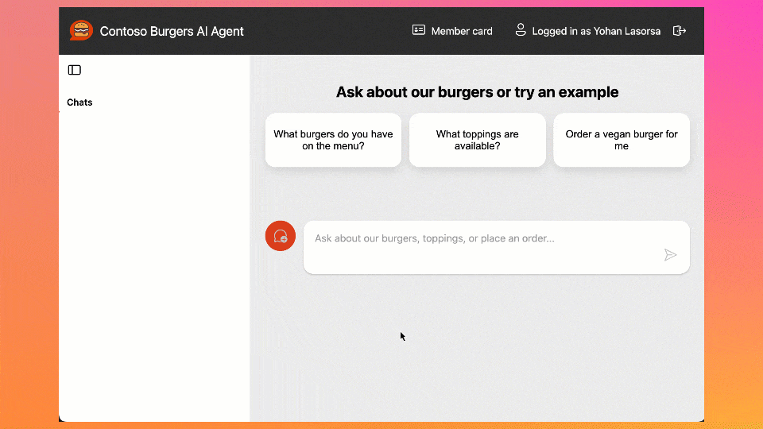

<div align="center">


# AI Agent with MCP tools using LangChain.js

[](https://codespaces.new/Azure-Samples/mcp-agent-langchainjs?hide_repo_select=true&ref=main&quickstart=true)
[](https://discord.gg/kzRShWzttr)
<br>
[](https://github.com/Azure-Samples/mcp-agent-langchainjs/actions)

[](https://www.typescriptlang.org)
[](LICENSE)

⭐ If you like this sample, star it on GitHub — it helps a lot!

[Overview](#overview) • [Architecture](#architecture) • [Getting started](#getting-started) • [Local development](#local-development) • [Deployment](#deployment) • [Resources](#resources) • [Troubleshooting](#troubleshooting)



</div>

## Overview

This sample shows how to build a serverless AI agent that can take real actions through an existing business API using the **Model Context Protocol (MCP)**. The demo scenario is a burger restaurant: users chat with an AI assistant to explore the menu and place orders. The agent uses **LangChain.js** to decide when to call MCP tools connected to a burger ordering API.

The application is hosted on [Azure Static Web Apps](https://learn.microsoft.com/azure/static-web-apps/overview) (web apps) and [Azure Functions](https://learn.microsoft.com/azure/azure-functions/functions-overview?pivots=programming-language-javascript) (API and MCP servers), with [Azure Cosmos DB for NoSQL](https://learn.microsoft.com/azure/cosmos-db/nosql/) for data storage. You can use it as a starting point for building your own AI agents.

### Key features

- LangChain.js agent with tool calling via MCP (Streamable HTTP transport)
- Multi-service, end‑to‑end architecture (web UIs, APIs, MCP server)
- User authentication with sessions history
- 100% serverless architecture, for cost-effective scaling
- Single-command deployment using Infrastructure as Code (IaC)

## Architecture

Building AI applications can be complex and time-consuming, but using LangChain.js and Azure serverless technologies allows to greatly simplify the process. This application is a AI agent that can be access through different interfaces (web app, CLI) and that can call tools through MCP to interact with a burger ordering API.


The application is made from these main components:

| Component | Folder | Purpose |
|-------|--------|---------|
| Agent Web App | `packages/agent-webapp` | Chat interface + conversation rendering |
| Agent API | `packages/agent-api` | LangChain.js agent + chat state + MCP client |
| Burger API | `packages/burger-api` | Core burger & order management web API |
| Burger MCP Server | `packages/burger-mcp` | Exposes burger API as MCP tools |
| Burger Web App | `packages/burger-webapp` | Live orders visualization |
| Infrastructure | `infra` | Bicep templates (IaC) |

Additionally, these support components are included:

| Component | Folder | Purpose |
|-------|--------|---------|
| Agent CLI | `packages/agent-cli` | Command-line interface LangChain.js agent and MCP client |
| Data generation | `packages/burger-data` | Scripts to (re)generate burgers data & images |

## Getting started

### 1. Prerequisites

- Node.js >= 22 / npm >= 10
- Git
- (For full Azure deployment) Azure CLI, Azure Developer CLI (`azd`), Azure Functions Core Tools, Static Web Apps CLI

### 2. Clone & install

```bash
git clone https://github.com/Azure-Samples/mcp-agent-langchainjs
cd mcp-agent-langchainjs
npm install
```

### 3. Run all services locally

```bash
npm start
```

When you see the consolidated readiness banner:

```
- Agent webapp  : http://localhost:4280
- Burger webapp : http://localhost:5173
- Burger MCP    : http://localhost:3000/mcp
```

Burger API (Functions) also runs locally (commonly on `http://localhost:7071`). Agent API runs on `http://localhost:7072`.

> [!TIP]
> Want a faster UI-only iteration loop? Start individual packages (e.g. `npm run start --workspace=agent-webapp`).

### 4. Chat & order

Open the Agent webapp and ask things like:

> What spicy burgers do you have?  
> Order two Classic Cheeseburgers with extra bacon.  
> Show my recent orders.

The agent will decide which MCP tool(s) to call; tool call results are streamed back into the conversation.

## Local development

Common scripts (run from repo root unless noted):

| Action | Command |
|--------|---------|
| Start everything | `npm start` |
| Build all | `npm run build` |
| Lint | `npm run lint` |
| Fix lint | `npm run lint:fix` |
| Format | `npm run format` |

Per-package development (examples):

```bash
npm run start --workspace=burger-api      # Burger API (Functions)
npm run start --workspace=agent-api       # Agent API (Functions)
npm run start --workspace=burger-mcp      # MCP server (HTTP /mcp & /sse)
npm run start --workspace=agent-webapp    # Agent chat UI
npm run start --workspace=burger-webapp   # Orders dashboard
```

Use mock data where available:

```bash
npm run start:mock --workspace=agent-webapp
npm run start:mock --workspace=burger-webapp
```

### MCP inspection

You can explore tools interactively:

```bash
npx -y @modelcontextprotocol/inspector
```

Open the displayed local URL, choose Streamable HTTP, and connect to `http://localhost:3000/mcp` then list & invoke tools.

> [!NOTE]
> An SSE endpoint is also available at `/sse` for backward compatibility.

## Deployment

Provision & deploy all Azure resources using **Azure Developer CLI**:

```bash
azd auth login
azd up            # (provisions + deploys) or split: azd provision && azd deploy
```

After provisioning, hooks populate a root `.env` file (`azd env get-values > .env`) and `npm run env` prints resolved service URLs.

Subsequent incremental deploys:

```bash
azd deploy agent-api
azd deploy burger-api
```

> [!TIP]
> The Static Web Apps services build automatically; the `burger-webapp` predeploy hook ensures `BURGER_API_URL` is set.

## MCP tools

Provided by `burger-mcp`:

| Tool | Description |
|------|-------------|
| `get_burgers` | List burgers |
| `get_burger_by_id` | Fetch a burger |
| `get_toppings` | List toppings (filterable) |
| `get_topping_by_id` | Fetch a topping |
| `get_topping_categories` | List topping categories |
| `get_orders` | List orders (user / status filters) |
| `get_order_by_id` | Fetch order details |
| `place_order` | Create an order (requires user context) |
| `delete_order_by_id` | Cancel pending order |

These map directly to REST endpoints on `burger-api`. The agent selects them via tool-calling decisions.


## Troubleshooting

| Symptom | Possible cause / fix |
|---------|----------------------|
| Agent can’t list burgers | MCP server not started or wrong `BURGER_MCP_URL` / local port mismatch |
| Tool calls hang | Check MCP server logs; ensure Streamable HTTP endpoint `/mcp` reachable |
| Orders never advance status | Timer function not running (Functions host not active) |
| Missing images | Blob storage not provisioned yet; fallback data may omit images |
| Auth issues in SWA | Ensure you’re running via `swa start` (agent-webapp start script) |

> [!TIP]
> Use the MCP Inspector to isolate whether issues lie in the agent’s reasoning layer or underlying tools.
