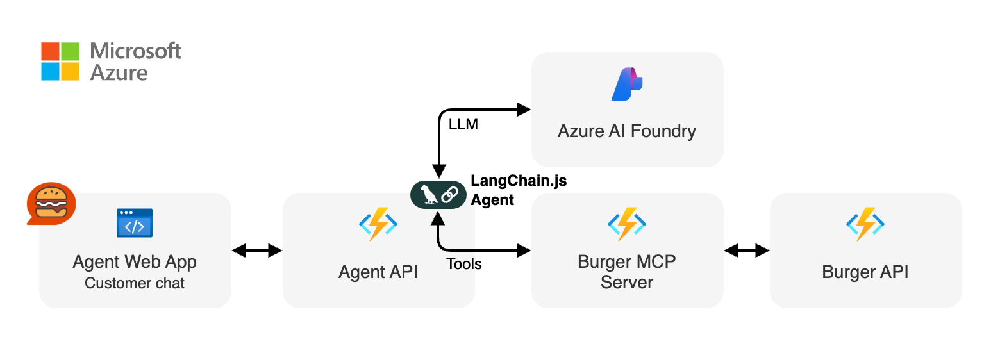
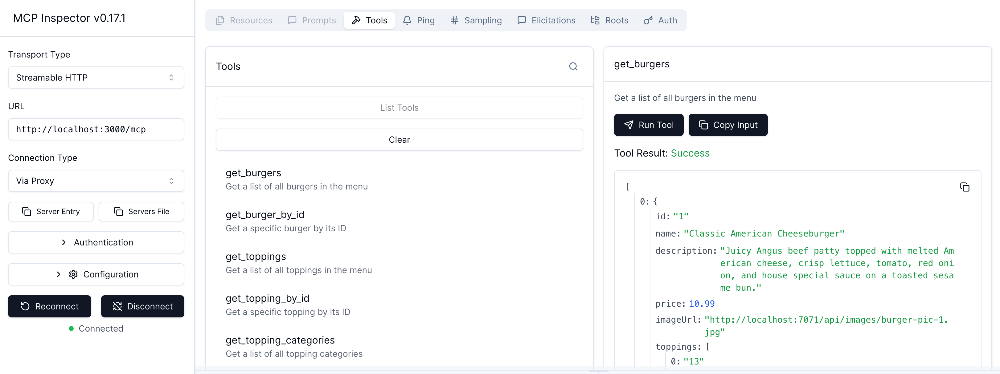

AI agents that can actually do stuff (not just chat) are the fun part nowadays, but wiring them cleanly into real APIs, keeping things observable, and shipping them to the cloud can get... messy. So we built a fresh end‑to‑end sample to show how to do it right with the brand new **LangChain.js v1** and **Model Context Protocol (MCP)**. In case you missed it, MCP is a recent open standard that makes it easy for LLM agents to consume tools and APIs, and LangChain.js, a great framework for building GenAI apps and agents, has first-class support for it.

This new sample gives you:
- A LangChain.js v1 agent that streams its result, along reasoning + tool steps
- An MCP server exposing real tools (burger menu + ordering) from a business API
- A web interface with authentication, sessions history, and a debug panel (for developers)
- A production-ready multi-service architecture
- Serverless deployment on Azure in one command (`azd up`)


Yes, it’s a burger ordering system. Who doesn't like burgers? Grab your favorite beverage ☕, and let’s dive in for a quick tour!

## TL;DR key takeaways

- New sample: full-stack Node.js AI agent using LangChain.js v1 + MCP tools
- Architecture: web app → agent API → MCP server → burger API
- Runs locally with a single `npm start`, deploys with `azd up`
- Uses streaming (NDJSON) with intermediate tool + LLM steps surfaced to the UI
- Ready to fork, extend, and plug into your own domain / tools

## What will you learn here?

- What this sample is about and its high-level architecture
- What LangChain.js v1 brings to the table for agents
- How to deploy and run the sample
- How MCP tools can expose real-world APIs

## Reference links for everything we use

- [GitHub repo](https://github.com/Azure-Samples/mcp-agent-langchainjs)
- [LangChain.js docs](https://docs.langchain.com/oss/javascript/langchain/overview)
- [Model Context Protocol](https://modelcontextprotocol.io)
- [Azure Developer CLI](https://learn.microsoft.com/azure/developer/azure-developer-cli/)
- [MCP Inspector](https://www.npmjs.com/package/@modelcontextprotocol/inspector)

## Use case

You want an AI assistant that can take a natural language request like “Order two spicy burgers and show me my pending orders” and:
- Understand intent (query menu, then place order)
- Call the right MCP tools in sequence, calling in turn the necessary APIs
- Stream progress (LLM tokens + tool steps)
- Return a clean final answer

Swap “burgers” for “inventory”, “bookings”, “support tickets”, or “IoT devices” and you’ve got a reusable pattern!

## Sample overview

Before we play a bit with the sample, let's have a look at the main services implemented here:

| Service | Role | Tech |
| ------- | ---- | ---- |
| Agent Web App (`agent-webapp`) | Chat UI + streaming + session history | Azure Static Web Apps, Lit web components |
| Agent API (`agent-api`) | LangChain.js v1 agent orchestration + auth + history | Azure Functions, Node.js |
| Burger MCP Server (`burger-mcp`) | Exposes burger API as tools over MCP (Streamable HTTP + SSE) | Azure Functions, Express, MCP SDK |
| Burger API (`burger-api`) | Business logic: burgers, toppings, orders lifecycle | Azure Functions, Cosmos DB |

Here's a simplified view of how they interact:



There are also other supporting components like databases and storage not shown here for clarity.

For this quickstart we'll only interact with the **Agent Web App** and the **Burger MCP Server**, as they are the main stars of the show here.

### LangChain.js v1 agent features

The recent release of LangChain.js v1 is a huge milestone for the JavaScript AI community! It marks a significant shift from experimental tools to a production-ready framework. The new version doubles down on what’s needed to build robust AI applications, with a strong focus on **agents**. This includes first-class support for streaming not just the final output, but also intermediate steps like tool calls and agent reasoning. This makes building transparent and interactive agent experiences (like the one in this sample) much more straightforward.

## Quickstart

### Requirements

- [GitHub account](https://github.com/signup)
- [Azure account](https://azure.microsoft.com/free) (free signup, or if you're a student, [get free credits here](https://azure.microsoft.com/free/students))
- [Azure Developer CLI](https://learn.microsoft.com/azure/developer/azure-developer-cli/install-azd?tabs=winget-windows%2Cbrew-mac%2Cscript-linux&pivots=os-windows)

### Deploy and run the sample

We'll use GitHub Codespaces for a quick zero-install setup here, but if you prefer to run it locally, check the [README](https://github.com/Azure-Samples/mcp-agent-langchainjs?tab=readme-ov-file#getting-started).

Click on the following link or open it in a new tab to launch a Codespace:

- [Create Codespace](https://codespaces.new/Azure-Samples/mcp-agent-langchainjs?hide_repo_select=true&ref=main&quickstart=true)

This will open a VS Code environment in your browser with the repo already cloned and all the tools installed and ready to go.

#### Provision and deploy to Azure

Open a terminal and run these commands:

```sh
# Install dependencies
npm install

# Login to Azure
azd auth login

# Provision and deploy all resources
azd up
```

Follow the prompts to select your Azure subscription and region. If you're unsure of which one to pick, choose `East US 2`.
The deployment will take about 15 minutes the first time, to create all the necessary resources (Functions, Static Web Apps, Cosmos DB, AI Models).

If you're curious about what happens under the hood, you can take a look at the `main.bicep` file in the `infra` folder, which defines the infrastructure as code for this sample.

### Test the MCP server

While the deployment is running, you can run the MCP server and API locally (even in Codespaces) to see how it works. Open another terminal and run:

```sh
npm start
```

This will start all services locally, including the Burger API and the MCP server, which will be available at `http://localhost:3000/mcp`. This may take a few seconds, wait until you see this message in the terminal:

```
🚀 All services ready 🚀
```

When these services are running without Azure resources provisioned, they will use in-memory data instead of Cosmos DB so you can experiment freely with the API and MCP server, though the agent won't be functional as it requires a LLM resource.

#### MCP tools

The MCP server exposes the following tools, which the agent can use to interact with the burger ordering system:

| Tool Name                | Description                                                                                  |
| ------------------------ | -------------------------------------------------------------------------------------------- |
| `get_burgers`            | Get a list of all burgers in the menu                                                        |
| `get_burger_by_id`       | Get a specific burger by its ID                                                              |
| `get_toppings`           | Get a list of all toppings in the menu                                                       |
| `get_topping_by_id`      | Get a specific topping by its ID                                                             |
| `get_topping_categories` | Get a list of all topping categories                                                         |
| `get_orders`             | Get a list of all orders in the system                                                       |
| `get_order_by_id`        | Get a specific order by its ID                                                               |
| `place_order`            | Place a new order with burgers (requires `userId`, optional `nickname`)                      |
| `delete_order_by_id`     | Cancel an order if it has not yet been started (status must be `pending`, requires `userId`) |

You can test these tools using the MCP Inspector. Open another terminal and run:

```sh
npx -y @modelcontextprotocol/inspector
```

Then open the URL printed in the terminal in your browser and connect using these settings:
- **Transport**: Streamable HTTP
- **URL**: http://localhost:3000/mcp
- **Connection Type**: Via Proxy (should be default)

Click on **Connect**, then try listing the tools first, and run `get_burgers` tool to get the menu info.



### Test the Agent Web App

After the deployment is completed, you can run the command `npm run env` to print the URLs of the deployed services. Open the Agent Web App URL in your browser (it should look like `https://<your-web-app>.azurestaticapps.net`).

You'll first be greeted by an authentication page, you can sign in either with your GitHub or Microsoft account and then you should be able to access the chat interface.


From there, you can start asking any question or use one of the suggested prompts, for example try asking: `Recommend me an extra spicy burger`.

As the agent processes your request, you'll see the response streaming in real-time, along with the intermediate steps and tool calls. Once the response is complete, you can also unfold the debug panel to see the full reasoning chain and the tools that were invoked:


> **Tip:** Our agent service also sends detailed tracing data using OpenTelemetry. You can explore these either in Azure Monitor for the deployed service, or locally using an OpenTelemetry collector. We'll cover this in more detail in a future post.

## Wrap it up

Congratulations, you just finished spinning up a full-stack serverless AI agent using LangChain.js v1, MCP tools, and Azure’s serverless platform. Now it's your turn to dive in the code and extend it for your use cases! 😎 And don't forget to `azd down` once you're done to avoid any unwanted costs.

## Going further

This was just a quick introduction to this sample, and you can expect more in-depth posts and tutorials soon.

Since we're in the era of AI agents, we've also made sure that this sample can be explored and extended easily with code agents like GitHub Copilot.
We even built a custom chat mode to help you discover and understand the codebase faster! Check out the [Copilot setup guide](.https://github.com/Azure-Samples/mcp-agent-langchainjs/blob/main/docs/copilot.md) in the repo to get started.

If you like this sample, don't forget to star the repo ⭐️! You can also join us in the [Azure AI community Discord](https://aka.ms/foundry/discord) to chat and ask any questions.

Happy coding and burger ordering! 🍔
