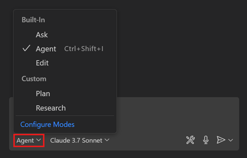

# Setting up and using GitHub Copilot with this repository

This repository has been designed to work seamlessly with GitHub Copilot, an AI-powered code companion tool that can help you learn and write code faster.

GitHub Copilot [can be used for FREE](https://github.blog/news-insights/product-news/github-copilot-in-vscode-free/) in VS Code, Visual Studio and Codespaces, follow the instructions below to get started.

> [!TIP]
> In addition to Copilot Free tier, students, educators, and open source maintainers also can have a free access to unlimited Copilot Pro.

## Setup

Go to this [GitHub Copilot page](https://github.com/features/copilot) and click on the "Get started for free" button to enable GitHub Copilot for your account.

Once you have enabled GitHub Copilot, you need to login to GitHub Copilot in your IDE:

- **VS Code**: Install the [GitHub Copilot extension](https://marketplace.visualstudio.com/items?itemName=GitHub.copilot) from the VS Code marketplace. After installing the extension, you will be prompted to sign in to GitHub and authorize the extension to access your account.
- **Visual Studio**: Follow the instructions in this [GitHub Copilot for Visual Studio documentation](https://learn.microsoft.com/visualstudio/ide/copilot-free-plan?view=vs-2022).
- **Codespaces**: GitHub Copilot is pre-installed in Codespaces. You just need to sign in to your GitHub account when prompted.

## Using GitHub Copilot

Once you have set up GitHub Copilot, you can start using it to assist you with learning and coding tasks in this repository.

First, open the repository in your IDE, and open a Copilot chat window. In VS Code, you use `⌃⌘I` on Mac or `Ctrl+Alt+I` on Windows/Linux to open the chat.

From there, you attach files or folders from the repository to the chat context, and you can start asking questions about the codebase, such as:

- "Explain me like I'm five what Agent API does, under 100 words."

### Using the different chat modes

Copilot chat supports different chat modes that can help you get more specific answers or actions based on your needs. You can switch between chat modes by clicking on the mode selector in the chat window.

Copilot comes with some built-in chat modes, such as:

- **Agent mode (default)**: Agent mode is optimized for making autonomous edits across multiple files in your project.
- **Ask mode**: Ask mode is optimized for answering questions about your codebase, coding, and general technology concepts.

### Codebase Explorer chat mode

In addition to the built-in chat modes, you can also create custom chat modes to tailor the experience to your specific needs. For example, we have created a custom chat mode called **"Codebase Explorer"** that is optimized for exploring and understanding the codebase of this repository. This modes may also first ask you some questions to better understand your skill level and adapt the answers accordingly.

Try selecting the "Codebase Explorer" chat mode from the chat modes selector, and then ask questions like:

- "How does the agent-webapp service communicate with the agent-api service?"

## Extending or customizing the sample

Once you're comfortable with the codebase, you can explore how to extend or customize the sample to fit your own use cases. You can modify existing code, add new features, or integrate with other services or APIs. **Agent mode** is the recommended chat mode for making such changes.

## Advanced usage

After you're more familiar with Copilot, you can explore more advanced features, such as customizing prompts, instructions or creating your own chat modes to suit your specific needs.

You can also explore the [Awesome Copilot repository](https://github.com/github/awesome-copilot) for community-created reusable prompts, chat modes, and other resources to enhance your Copilot experience.

## Resources

- [GitHub Copilot documentation](https://docs.github.com/copilot)
- [Use chat modes in VS Code](https://code.visualstudio.com/docs/copilot/customization/custom-chat-modes)
- [Tutorial: Getting started with GitHub Copilot](https://github.com/skills/getting-started-with-github-copilot)
